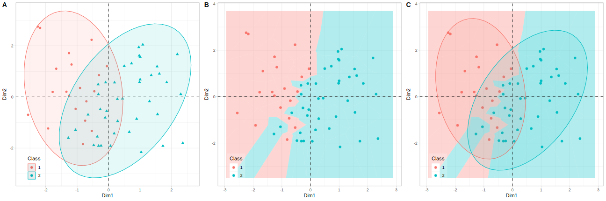

# voronoi_projection_plot

A lightweight R code snippet for creating Voronoi tessellation visualizations of 2D projected data, particularly useful for displaying results from dimensionality reduction techniques.

## Overview

ProjectionViz provides an intuitive way to visualize class separation in projected data using Voronoi diagrams. Voronoi tessellation divides the plot space into regions based on proximity to data points, offering an elegant visualization of class boundaries and decision regions that is particularly effective for understanding clustering and classification results.

## Features

- **Voronoi Tessellation Visualization**: Creates proximity-based regions showing natural class boundaries
- **Flexible Input Handling**: Works with various data formats and handles missing class labels gracefully
- **Customizable Aesthetics**: Full control over colors, transparency, point sizes, and styling
- **Label Support**: Optional case labeling with intelligent overlap avoidance
- **Publication Ready**: Clean, professional plots suitable for academic and business presentations

## Installation

You can install ProjectionViz directly from GitHub:

devtools::install_github("JornLotsch/voronoi_projection_plot")

## Dependencies

The package requires:
- `ggplot2` (for plotting)
- `deldir` (for Voronoi tessellation)
- `ggrepel` (optional, for smart label positioning)

## Quick Start

### Create sample projected data
set.seed(123)

projected_data <- data.frame(
  PC1 = rnorm(150, mean = rep(c(-2, 0, 2), each = 50)),
  PC2 = rnorm(150, mean = rep(c(1, -1, 0), each = 50))
)

### Add class labels
classes <- rep(c("Group A", "Group B", "Group C"), each = 50)

### Create Voronoi visualization
plot <- create_voronoi_plot(
  data = projected_data,
  class_column = classes,
  title = "PCA Projection with Voronoi Tessellation",
  coord_names = c("PC1", "PC2")
)

``` 

## Main Function: `create_voronoi_plot()`

### Parameters

| Parameter | Type | Default | Description |
|-----------|------|---------|-------------|
| `data` | data.frame | - | Data with ≥2 numeric columns for coordinates |
| `class_column` | character/vector | NULL | Column name or vector of class labels |
| `case_labels` | character vector | NULL | Individual case labels (uses row numbers if NULL) |
| `coord_names` | character vector | c("Dim1", "Dim2") | Names for coordinate axes |
| `title` | character | NULL | Plot title |
| `show_labels` | logical | FALSE | Whether to show case labels |
| `voronoi_alpha` | numeric | 0.3 | Transparency of Voronoi regions (0-1) |
| `point_size` | numeric | 2 | Size of data points |
| `legend_position` | character/numeric | c(0.1, 0.1) | Legend position |
| `color_palette` | function/character | NULL | Custom color palette |
| `add_grid_lines` | logical | TRUE | Whether to add origin grid lines |

```
## Examples

### Basic Visualization


